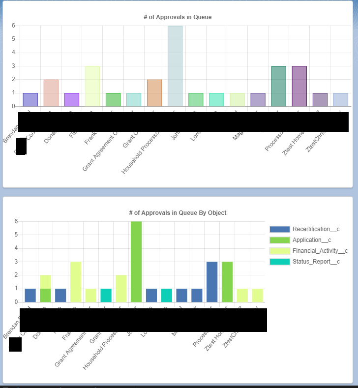

### Displays how many approvals processes are assigned to individual user's by sobject type.

#### Implements [LightningWebChartJS](https://github.com/SalesforceLabs/LightningWebChartJS)
## Example

